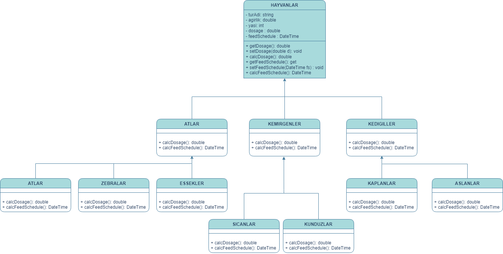

# Hayvanat Bahcesi Yonetimi

Hayvanlar:
1- Atlar (atlar, zebralar, eşekler vb.),
2- Kedigiller (kaplanlar, aslanlar vb.),
3- Kemirgenler (sıçanlar, kunduzlar vb.) gibi gruplardaki türlerle karakterize edilir.
4- Hayvanlar hakkında depolanan bilgilerin çoğu tüm gruplamalar için aynıdır.
tür adı, ağırlığı, yaşı vb.
5- Sistem ayrıca her hayvan için belirli ilaçların dozajını alabilmeli => getDosage ()
6- Sistem Yem verme zamanlarını hesaplayabilmelidir => getFeedSchedule ()

Sistemin bu işlevleri yerine getirme mantığı, her gruplama için farklıdır. Örneğin, atlar için yem verme algoritması farklı, kaplanlar için farklıdır.

